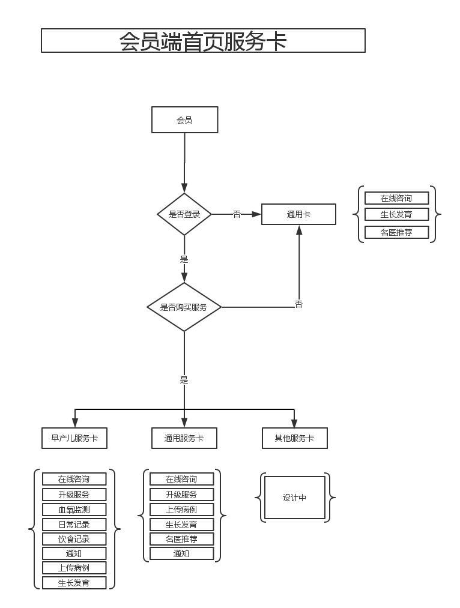
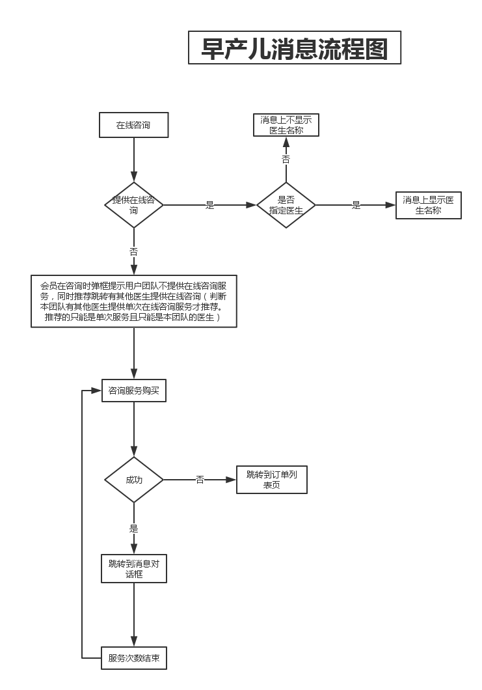
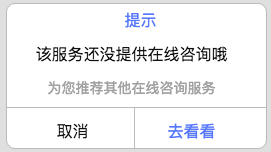
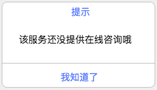
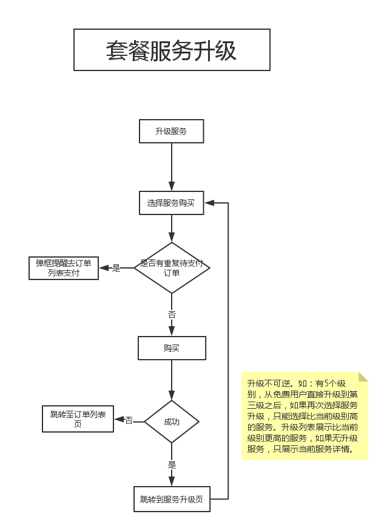

#首页【会员端】
首页显示将以服务卡的形式展示给用户，主要目的是为了解决对来自不同医院不同科室患者的个性化需求。个性化即平台根据用户购买不同的服务类别来展现相应的功能。我们的产品要达到用户体验流畅，功能逻辑清晰，操作简单。

###一、早产儿随访卡
主要服务于购买刘江勤团队早产儿随访的会员用户。
###1、消息
分为两种情况，提供在线咨询服务和不提供在线咨询服务。提供在线咨询服务会员可以向医生发送文字消息，否则在用户点击输入框的时候弹框提示用户不提供咨询服务。如果团队分配了指定咨询医生，在首页显示被指定咨询医生的名称。

- ####在线咨询推荐
> 如果该团队其他成员有提供在线咨询服务，用户点击输入框时弹框提示此服务不提供在线咨询，并向推荐团队内提供在线咨询的医生，且只能是提供的单次在线咨询服务。当用户购买了推荐的某个医生的单次在线咨询服务，在有效服务期间首页的在线咨询模块上显示的医生名称为提供单次咨询服务医生的名称（首页在线咨询医生名称显示逻辑为：如果该服务的在线咨询分配了指定医生就显示该医生的名称），仅在线咨询功能面向该被指定的医生，其他功能还是面向整个团队。

- ####在线咨询购买
> 当团队不提供在线咨询服务，但是团队中有某个医生提供单次在线咨询服务，系统弹框提示：
> 

> 
>点击跳转至推荐列表，选择某个推荐医生进行购买，点击购买跳转到支付页面。购买成功跳转到消息对话框，购买失败跳转到订单列表。
- 没有医生提供在线咨询服务
> 如果该团队中没有一个医生提供单独的在线咨询服务，用户点击输入框时弹框提示此服务不提供在线咨询，弹框内容如图：
> 
> 

###2.宝宝日常记录
宝宝日常记录包含的内容有：宝宝里程碑，成长发育评测，饮食记录。宝宝日常记录依托于宝宝里程碑，主要记录宝宝的某个激动人心的时刻，如：宝宝第一次叫妈妈。这个里程碑的内容包含一张照片，一句简单的阐述和一个标签。后续这个宝宝里程碑可以分享到任何平台与朋友一起分享。宝宝日常记录与宝宝里程碑的区别在于，在宝宝日常记录中包含记录宝宝其他的健康状况，如：宝宝成长发育评测，还有日常饮食。宝宝日常记录模块内容是可定制，根据服务卡不同，这个记录内容可以灵活的增删。

- ####宝宝里程碑
> 宝宝里程碑主要记录宝宝成长历程，可以用文字形式记录宝宝成长，可以添加图片，用标签来标示这次重大成长的意义。标签内容由系统提供一些固定的。文本必须填，不限字数，图片可以不上传，标签可以为空。宝宝里程碑列表中每个里程碑包含的内容为：日期，标签，文字描述，图片，宝宝年龄用天计算。如果用户没有选择标签则标题处显示文字描述内容，一行显示，显示不完的省略号。图片压缩显示。日期只显示当前为几号。
- ####成长发育评测
> 成长发育评测内容用户选填，点击更多跳转至个人中心智护评估历史列表，填写的内容不显示到首页。文字提醒用户提交后可在个人中心智护评测模块中查看。
- ####饮食记录
> 饮食记录内容用户选填，填写内容根据医生要求由后台配置，配置内容以一妇婴小册子为依据。文字提醒用户提交后可在个人中心智能随访模块中查看。显示逻辑：1、按照系统推送逻辑显示，如：系统在宝宝出院一个月的时候推送给用户饮食记录，此处就显示饮食问卷，如果用户完成了本次填写，那么就不显示饮食添加内容。

- ###3.升级服务
为满足用户更多的需求，升级服务孕育而生，主要是针对那些已经购买了服务的用户。根据医生提供服务的不同层次将其分级，由低级升向高级，且不可逆。

> 医生发布的某个服务能否升级由后台设置，如果可以升级则必须有相应的升级服务，且必须有升级后的差异。如果用户购买的某个服务可以升级，则在首页服务卡头部显示可升级标注，点击进入服务详情，显示当前服务的名称和领衔医生还有起始终止时间。升级区域展示升级前后的服务对比，显示当前服务的价格和升级后的价格，点击升级按钮跳转至支付界面，支付成功跳转至服务列表详情。